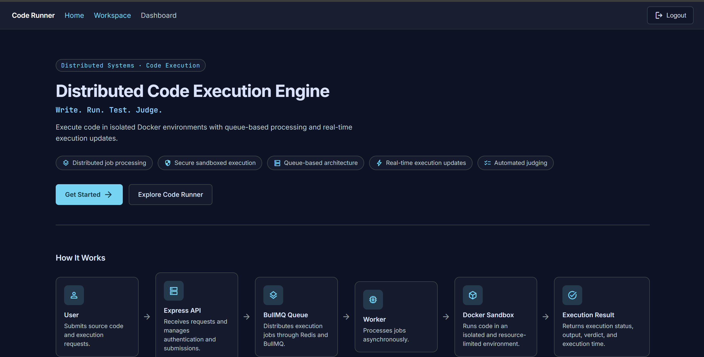
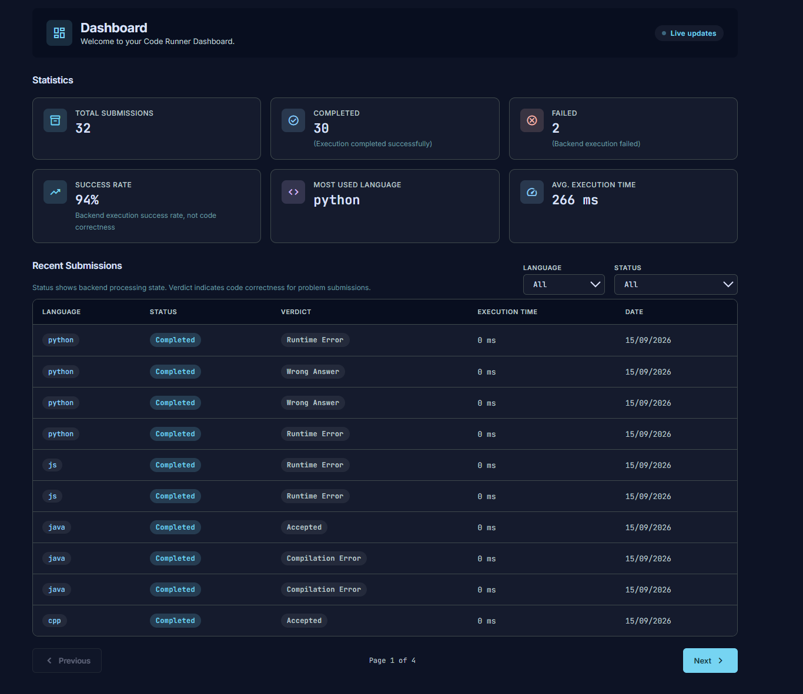
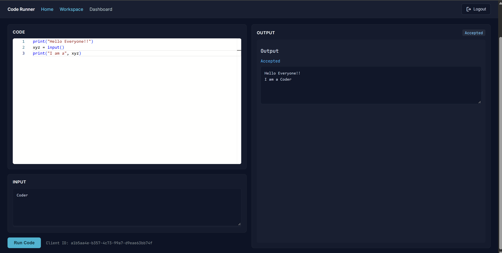
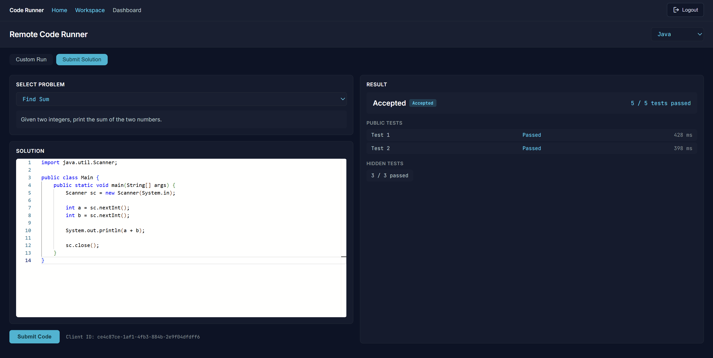
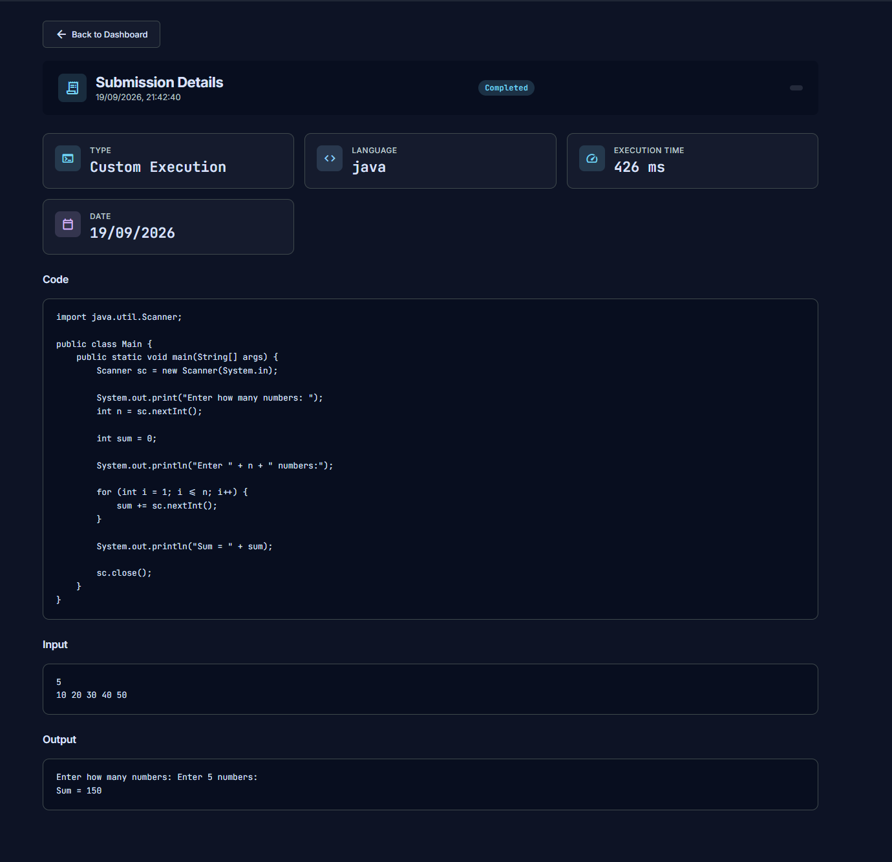
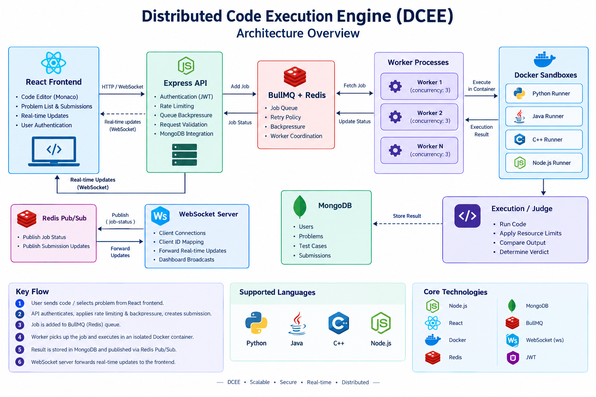

# Distributed Code Execution Engine


A distributed code execution and automated judging platform built with Node.js, Redis, BullMQ, Docker, MongoDB, and React.

DCEE allows users to run code with custom input or submit solutions to coding problems. Execution is handled asynchronously by worker processes and isolated Docker containers, while Redis Pub/Sub and WebSockets provide real-time status updates.

The project focuses on practical distributed-systems concepts including asynchronous job processing, workload distribution, failure handling, retries, backpressure, resource isolation, and real-time communication.

------------------------------------------------------------------------

## Demo

### Home


### Dashboard


### Code Execution


### Problem Judging


### Submission History


The following screenshots show the main user-facing workflows of DCEE, from authentication and code execution to automated judging and submission tracking.

## Table of Contents

- [Features](#features)
- [Architecture](#architecture)
- [Execution Flow](#execution-flow)
- [Reliability and Scalability](#reliability-and-scalability)
- [Real-Time Updates](#real-time-updates)
- [API Endpoints](#api-endpoints)
- [Tech Stack](#tech-stack)
- [Project Structure](#project-structure)
- [Local Development](#local-development)
- [Security and Resource Controls](#security-and-resource-controls)
- [Deployment](#deployment)
- [Deployment Observability](#deployment-observability)
- [Testing](#testing)
- [Future Improvements](#future-improvements)
- [License](#license)

------------------------------------------------------------------------

## Features

-   User registration and JWT-based authentication
-   Execute code with custom input
-   Automated problem judging
-   Public and hidden test cases
-   Support for JavaScript, Python, Java, and C++
-   Isolated Docker-based code execution
-   CPU, memory, process, execution-time, and output controls
-   Asynchronous job processing using BullMQ
-   Redis-backed job queue
-   Multiple concurrent workers
-   Automatic retry of infrastructure failures
-   Queue backpressure protection
-   API rate limiting
-   Real-time execution updates through WebSockets
-   Submission history and detailed submission results
-   Queue and service health monitoring
-   MongoDB persistence for users, problems, test cases, and submissions

------------------------------------------------------------------------

## Architecture




The system separates API request handling, asynchronous job processing,
code execution, judging, persistence, and real-time communication.

------------------------------------------------------------------------

## Execution Flow

### Direct Code Execution

1.  The frontend sends source code, language, and input to the API.
2.  The API authenticates the user.
3.  Rate limiting and queue backpressure checks are applied.
4.  A submission record is created in MongoDB.
5.  A BullMQ job is added to the Redis-backed queue.
6.  The API immediately returns `202 Accepted`.
7.  An available worker picks up the job.
8.  The worker executes the code inside an isolated Docker container.
9.  The result is stored in MongoDB.
10. Execution status is published through Redis Pub/Sub.
11. The WebSocket server forwards the status to the frontend.

This keeps code execution asynchronous instead of blocking the API
server.

### Automated Judging

When a user submits a solution:

1.  The API receives the problem ID, language, and source code.
2.  A queued submission is created.
3.  A `judge-code` job is added to BullMQ.
4.  A worker retrieves the problem's test cases from MongoDB.
5.  The solution is executed against the test cases.
6.  Program output is normalized before comparison.
7.  Public test results are returned.
8.  Hidden test results are tracked without exposing their data.
9.  The final verdict is stored with the submission.

Supported verdicts include:

-   Accepted
-   Wrong Answer
-   Compilation Error
-   Runtime Error
-   Time Limit Exceeded
-   Output Limit Exceeded
-   Unsupported Language

------------------------------------------------------------------------

## Reliability and Scalability

The execution system separates API request handling from code execution.

Workers consume jobs from the same BullMQ queue and can run as separate
processes.

Each worker has a configurable `WORKER_ID` and a concurrency of `3`.

For example:

``` text
                    Redis / BullMQ
                         |
          +--------------+--------------+
          |              |              |
       Worker 1       Worker 2       Worker N
       concurrency    concurrency    concurrency
           3              3              3
```

Jobs are not tied to a particular worker process. Multiple workers can
therefore consume execution jobs from the same queue.

Unexpected infrastructure errors can be retried according to the
configured BullMQ retry policy.

User-code failures such as TLE and OLE are handled as execution results
rather than being treated as infrastructure failures.

------------------------------------------------------------------------

### Job Reliability

Execution jobs are processed asynchronously through BullMQ.

Jobs are configured with:

``` text
Attempts: 3
Backoff:  2 seconds
Strategy: Fixed
```

### User-code failures

Examples:

-   Runtime Error
-   Time Limit Exceeded
-   Output Limit Exceeded
-   Compilation Error

These are returned as execution or judging results.

### Infrastructure failures

Unexpected worker or infrastructure errors are allowed to fail the
BullMQ job so that the configured retry mechanism can handle them.

This prevents normal programming mistakes from unnecessarily consuming
retry attempts while still providing resilience against transient
infrastructure problems.

------------------------------------------------------------------------

### Queue Backpressure and Rate Limiting

The API applies protection before adding execution jobs to the queue.

The project includes:

``` text
server/middleware/rateLimiter.js
server/middleware/queueBackpressure.js
```

Rate limiting controls excessive requests from clients.

Queue backpressure prevents the API from continuously accepting work
when the execution queue reaches unhealthy conditions.

Together, these mechanisms provide basic load protection for the
execution system.

------------------------------------------------------------------------


## Docker Sandboxing

Every submitted program is executed inside a temporary Docker container.

The runner applies the following restrictions:

  Resource            Limit
  ------------------- -----------------
  CPU                 1 CPU
  Memory              128 MB
  PID limit           64
  Network             Disabled
  Filesystem          Read-only
  `/tmp`              Temporary tmpfs
  Execution timeout   5 seconds
  Output limit        1 MB

Docker images are maintained separately for each supported language:

``` text
server/docker/
├── cpp/
│   └── Dockerfile
├── java/
│   └── Dockerfile
├── node/
│   └── Dockerfile
└── python/
    └── Dockerfile
```

These restrictions limit the resources available to submitted programs
and prevent containers from accessing the network.

------------------------------------------------------------------------

## Real-Time Updates

Execution status is distributed through Redis Pub/Sub and delivered to connected clients through the WebSocket server.

``` text
Worker
   |
   | publish("job-status")
   v
Redis Pub/Sub
   |
   v
WebSocket Server
   |
   v
React Client
```

The system publishes states such as:

-   `queued`
-   `active`
-   `completed`
-   `failed`

The WebSocket server associates connected clients with generated client
IDs and forwards execution updates to the appropriate client.

Submission updates can also be broadcast to connected dashboard clients
so that submission history can refresh without requiring a manual page
reload.

------------------------------------------------------------------------

## Observability and Health

The API exposes health endpoints and runtime information for basic service observability.

### Overall health

``` http
GET /health
```

The health check verifies:

-   Redis connectivity
-   MongoDB connectivity
-   Queue health

A healthy response returns HTTP `200`.

A degraded service returns HTTP `503`.

### Queue health

``` http
GET /health/queue
```

This endpoint exposes queue statistics used to monitor execution
workload.

------------------------------------------------------------------------

## API Endpoints

### Authentication

  Method   Endpoint            Description
  -------- ------------------- ------------------------------
  POST     `/auth/register`    Register a new user
  POST     `/auth/login`       Authenticate and receive JWT
  GET      `/auth/protected`   Test authenticated access

### Code Execution

  Method   Endpoint        Description
  -------- --------------- ---------------------------------
  POST     `/execute`      Queue code for direct execution
  GET      `/result/:id`   Retrieve execution result

**Example — queue code for execution**

Request:

``` http
POST /execute
Authorization: Bearer <jwt>
Content-Type: application/json

{
  "language": "python",
  "code": "print(input())",
  "input": "hello world"
}
```

Response (`202 Accepted`):

``` json
{
  "submissionId": "6710f1a2c9e4b1a2d3f4e5f6",
  "status": "queued"
}
```

Poll for the result:

``` http
GET /result/6710f1a2c9e4b1a2d3f4e5f6
Authorization: Bearer <jwt>
```

``` json
{
  "submissionId": "6710f1a2c9e4b1a2d3f4e5f6",
  "status": "completed",
  "stdout": "hello world\n",
  "stderr": "",
  "exitCode": 0,
  "executionTimeMs": 42
}
```

### Problem Judging

  Method   Endpoint                 Description
  -------- ------------------------ --------------------------------------
  POST     `/submit`                Submit code for automated judging
  GET      `/api/submissions`       Get authenticated user's submissions
  GET      `/api/submissions/:id`   Get a specific submission

Problem-related routes are available under `/api/problems`.

**Example — submit a solution for judging**

Request:

``` http
POST /submit
Authorization: Bearer <jwt>
Content-Type: application/json

{
  "problemId": "6710e0f1c9e4b1a2d3f4e5aa",
  "language": "cpp",
  "code": "#include <iostream>\nint main(){int a,b;std::cin>>a>>b;std::cout<<a+b;}"
}
```

Response (`202 Accepted`):

``` json
{
  "submissionId": "6710f2b3c9e4b1a2d3f4e5f7",
  "status": "queued"
}
```

Fetch the verdict once judging finishes:

``` http
GET /api/submissions/6710f2b3c9e4b1a2d3f4e5f7
Authorization: Bearer <jwt>
```

``` json
{
  "submissionId": "6710f2b3c9e4b1a2d3f4e5f7",
  "problemId": "6710e0f1c9e4b1a2d3f4e5aa",
  "verdict": "Accepted",
  "publicResults": [
    { "testCase": 1, "passed": true },
    { "testCase": 2, "passed": true }
  ],
  "hiddenTestsPassed": 8,
  "hiddenTestsTotal": 8,
  "executionTimeMs": 61
}
```

### Monitoring

  Method   Endpoint          Description
  -------- ----------------- -----------------------------
  GET      `/health`         Overall service health
  GET      `/health/queue`   Queue health and statistics

------------------------------------------------------------------------

## Tech Stack

### Frontend

-   React
-   Vite
-   React Router
-   Monaco Editor
-   WebSocket

### Backend

-   Node.js
-   Express
-   BullMQ
-   Redis
-   MongoDB
-   Mongoose
-   WebSocket (`ws`)
-   JWT
-   bcrypt
-   rate-limiter-flexible

### Code Execution

-   Docker
-   Python
-   Java
-   C++
-   Node.js

------------------------------------------------------------------------

## Project Structure

``` text
Distributed-Code-Execution-Engine/
|
├── client/
│   ├── src/
│   │   ├── components/
│   │   ├── context/
│   │   ├── services/
│   │   ├── App.jsx
│   │   └── main.jsx
│   ├── package.json
│   └── vite.config.js
|
├── server/
│   ├── config/
│   ├── controllers/
│   ├── docker/
│   │   ├── cpp/
│   │   ├── java/
│   │   ├── node/
│   │   └── python/
│   ├── executors/
│   ├── judge/
│   ├── middleware/
│   ├── models/
│   ├── routes/
│   ├── seed/
│   ├── utils/
│   ├── execute.js
│   ├── queue.js
│   ├── redis.js
│   ├── server.js
│   ├── websocket.js
│   └── worker.js
|
└── README.md
```
The `client` directory contains the React frontend, while the `server` directory contains the API, queue, workers, WebSocket server, judging logic, and execution infrastructure.

------------------------------------------------------------------------

## Local Development

### Prerequisites

Make sure the following are installed and running:

- Node.js
- npm
- Redis
- MongoDB
- Docker

Clone the repository:

``` bash
git clone https://github.com/Rudranshi157/Distributed-Code-Execution-Engine.git
cd Distributed-Code-Execution-Engine
```

### Backend

``` bash
cd server
npm install
```

Create `server/.env` using the variables defined in `.env.example`:

```env
NODE_ENV=development
PORT=3000
WS_PORT=9000
REDIS_HOST=localhost
REDIS_PORT=6379
JWT_SECRET=your_secret
JWT_EXPIRES_IN=1d
MONGO_URI=your_mongodb_connection_string
```

Start the API:

``` bash
npm start
```

Start the WebSocket server in another terminal:

``` bash
npm run websocket
```

Start a worker in another terminal:

``` bash
npm run worker
```

Multiple worker processes can be started to distribute execution jobs:

``` bash
WORKER_ID=worker-1 npm run worker
WORKER_ID=worker-2 npm run worker
```

### Frontend

``` bash
cd client
npm install
npm run dev
```

The Vite development server will provide the frontend URL.

------------------------------------------------------------------------

## Environment Variables

The backend expects:

  Variable           Purpose
  ------------------ ----------------------------
  `NODE_ENV`         Runtime environment
  `PORT`             Express API port
  `WS_PORT`          WebSocket server port
  `REDIS_HOST`       Redis hostname
  `REDIS_PORT`       Redis port
  `JWT_SECRET`       JWT signing secret
  `JWT_EXPIRES_IN`   JWT expiration duration
  `MONGO_URI`        MongoDB connection string
  `WORKER_ID`        Optional worker identifier

Never commit actual `.env` files or production secrets to version
control.

------------------------------------------------------------------------

## Database Models

The backend uses MongoDB with Mongoose.

Core models include:

``` text
User
Submission
Problem
TestCase
```

### User

Stores registered user information and authentication-related data.

### Problem

Stores coding problems used by the automated judge.

### TestCase

Stores problem inputs and expected outputs, including whether a test
case is hidden.

### Submission

Stores submitted code, execution state, verdicts, results, and execution
metadata.

------------------------------------------------------------------------

## Security and Resource Controls

The execution layer includes several controls designed to reduce the
impact of untrusted submitted code:

-   Authentication required for execution endpoints
-   JWT-based authorization
-   Request rate limiting
-   Queue backpressure
-   Docker isolation
-   Network-disabled containers
-   Read-only container filesystem
-   Memory limit
-   CPU limit
-   PID limit
-   Execution timeout
-   Output limits
-   Request body size limit

The system is a project-level sandboxed execution environment and should
not be considered a hardened production security boundary without
further security review.

------------------------------------------------------------------------

## Deployment

The project is deployed using an AWS EC2-based architecture.

The deployed backend separates the major runtime components:

``` text
AWS EC2
|
├── Express API
├── BullMQ Worker(s)
├── WebSocket Server
└── Docker
    ├── Python runner
    ├── Java runner
    ├── Node.js runner
    └── C++ runner
```

Redis and MongoDB are configured through environment variables.

Production secrets are supplied through environment configuration rather
than committed to the repository.

------------------------------------------------------------------------

## Deployment Observability

The deployed backend provides runtime observability through:

-   API request logging
-   Worker job logging
-   Queue health information
-   Redis connectivity status
-   MongoDB connectivity status
-   Worker identifiers
-   Job attempt information
-   Execution status updates

The `/health` endpoint can be used by a monitoring system or deployment
workflow to verify service health.

------------------------------------------------------------------------

## Testing

Automated test coverage is not yet in place for this project. Manual
functional testing has been performed for API endpoints, code execution,
the judging pipeline, worker execution, and key verdicts including
Accepted, Wrong Answer, Runtime Error, Time Limit Exceeded, and Output
Limit Exceeded.

Automated test coverage and CI are planned as future improvements.

------------------------------------------------------------------------

## Future Improvements

Potential future improvements include:

-   Persistent worker/process management
-   More advanced queue scheduling
-   Improved observability and metrics
-   Centralized structured logging
-   More programming language runtimes
-   More sophisticated sandboxing
-   Horizontal scaling across multiple machines
-   More advanced judge features
-   Administrative problem management
-   Improved test coverage and automated CI/CD

------------------------------------------------------------------------

## Project Goals

The project was built to explore practical backend and
distributed-systems concepts including:

-   Asynchronous job processing
-   Message queues
-   Worker-based architectures
-   Distributed workload processing
-   Containerized execution
-   Resource isolation
-   Real-time communication
-   Database persistence
-   Authentication and authorization
-   Rate limiting
-   Backpressure
-   Failure handling
-   Retry mechanisms
-   Health checks and observability

Rather than executing user code directly inside the API process, DCEE
separates request handling, workload scheduling, execution, judging,
persistence, and real-time communication into cooperating components.

------------------------------------------------------------------------

## License

This project is currently intended as a personal learning and portfolio
project.
